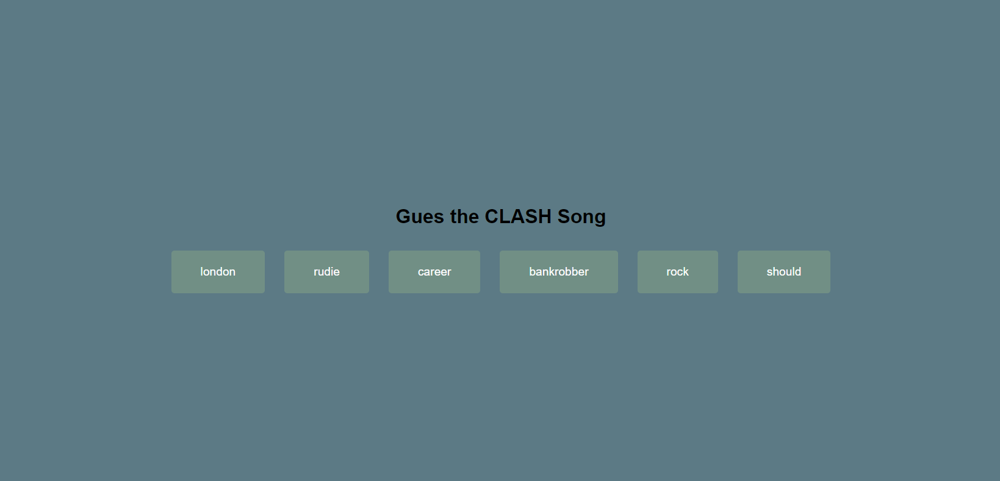

# Sound Board

This mini project was developed as part of the "50 Projects in 50 Days - HTML, CSS & JavaScript" course by **Brad Traversy**, aimed at deepening my knowledge through practical experience.

## Screenshot

[Live Preview](https://milanilic-w28.github.io/sound-board-test/)
